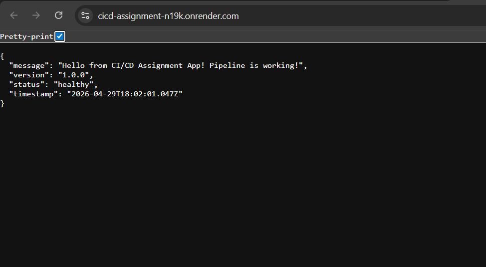
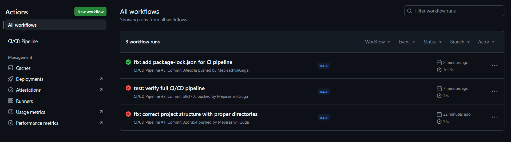

# CI/CD Pipeline Automation & Deployment Strategies

> **Assignment 1 — Week 1** | DevOps Workflows

---

## 🌐 Live Application

**Production URL:** `https://your-app-name.onrender.com`

> ⚠️ *Replace this URL with your actual Render service URL after first deployment.*

---

## 📸 Screenshots

### Hosted Application

> Add a screenshot of your live app here after deployment.
> Example: ``

```

```

### Successful GitHub Actions Run

> Add a screenshot of your passing GitHub Actions pipeline here.
> Example: ``

```

```

---

## 🏗️ Project Structure

```
cicd-assignment/
├── .github/
│   └── workflows/
│       └── main.yml          # CI/CD pipeline definition
├── src/
│   ├── app.js                # Express application (routes & logic)
│   └── server.js             # Server entry point
├── tests/
│   └── app.test.js           # Jest test suite (7 tests)
├── package.json
├── .gitignore
└── README.md
```

---

## 🔄 CI/CD Pipeline Description

The pipeline is defined in `.github/workflows/main.yml` and consists of **two sequential stages**.

### Trigger Conditions

| Event | Branch | CI runs? | CD runs? |
|---|---|---|---|
| `push` | `main` | ✅ Yes | ✅ Yes (if CI passes) |
| `push` | `develop` | ✅ Yes | ❌ No |
| `pull_request` → `main` | any | ✅ Yes | ❌ No |

---

### Stage 1 — Continuous Integration (Quality Gate)

**Job name:** `test`

```
Push/PR event
     │
     ▼
┌──────────────────────────────────────┐
│  CI Quality Gate                     │
│                                      │
│  1. Checkout code                    │
│  2. Set up Node.js (18.x AND 20.x)  │
│  3. npm ci  (install deps)           │
│  4. npm test  (run Jest suite)       │
│  5. Upload coverage artifact         │
└──────────────────────────────────────┘
     │                │
   PASS             FAIL
     │                │
     ▼                ▼
  Stage 2         ❌ Pipeline
  (deploy)           stops here
```

**Key rule:** If *any* test fails, the entire pipeline stops. The `deploy` job has `needs: test`, so GitHub Actions will not even schedule it if the `test` job exits with a non-zero code.

The CI runs tests against **two Node.js versions in parallel** (a matrix strategy) to ensure compatibility.

---

### Stage 2 — Continuous Deployment

**Job name:** `deploy`

```
CI passed + push to main
          │
          ▼
┌───────────────────────────────────┐
│  Deploy to Render                 │
│                                   │
│  1. Trigger Render deploy hook    │
│  2. Wait 30s for deployment       │
│  3. Health-check /health endpoint │
│  4. Report success / failure      │
└───────────────────────────────────┘
```

The deployment is triggered via a **Render Deploy Hook** (a secret webhook URL stored in GitHub Secrets as `RENDER_DEPLOY_HOOK_URL`). After the hook is called, the pipeline waits and then performs an automated health check to confirm the new version is live and responding correctly.

---

## 🚀 Deployment Strategy: Rolling Update (via Render)

### Strategy Chosen: Rolling Update

A **Rolling Update** replaces instances of the old application version with the new one gradually, ensuring zero downtime during deployments.

### Why This Strategy?

Render's free tier runs a single web service instance. When a new deploy is triggered:

1. Render **builds** the new version in an isolated environment.
2. Once the build succeeds, Render **switches traffic** from the old instance to the new one.
3. The old instance is only terminated *after* the new instance is confirmed healthy.

This is effectively a rolling replacement — at no point is the application fully offline.

### How It Was Implemented

| Step | Action |
|---|---|
| **1. Deploy Hook Secret** | A `RENDER_DEPLOY_HOOK_URL` secret is stored in GitHub repository settings. |
| **2. Automated Trigger** | The CD job calls this hook via `curl`, initiating a build on Render. |
| **3. Health Verification** | After a 30-second wait, the pipeline sends a `GET /health` request to the live URL. A non-`200` response fails the pipeline and alerts the team. |
| **4. Zero Downtime** | Render holds the old instance alive until the new one passes its own startup health checks. |

### Simulating the Strategy

To simulate and verify the rolling behaviour on the free tier:

1. Make a visible change (e.g., update the `version` field in `package.json`).
2. Push to `main`.
3. While the build is in progress, visit the live URL — the old version continues serving requests.
4. Once Render's dashboard shows "Deploy live", the new version is active with no gap in availability.

---

## ⏪ Rollback Guide

### Scenario
A bug has been discovered in production after a recent deployment. You need to revert to the previous stable version immediately.

---

### Method 1: Render Dashboard Manual Rollback (Fastest — ~2 minutes)

1. Log in to [https://render.com](https://render.com) and open your **Dashboard**.
2. Click on your web service (e.g., `cicd-assignment-app`).
3. Navigate to the **"Deploys"** tab on the left sidebar.
4. You will see a chronological list of all past deployments with their commit SHA and status.
5. Find the last deployment marked **"Live"** before the broken one.
6. Click the **"↩ Rollback to this deploy"** button (three-dot menu → Rollback).
7. Render will instantly re-activate that build — no new build is triggered, it uses the cached image.
8. Monitor the **"Logs"** tab to confirm the service restarts cleanly.
9. Verify by visiting `GET /health` — confirm it returns `200 OK`.

> ⏱ **Estimated downtime:** ~0 seconds (Render swaps the running instance).

---

### Method 2: Git Revert + Push (Traceable — ~5 minutes)

Use this approach when you want a clean, auditable record in your Git history.

```bash
# 1. Find the last known-good commit SHA
git log --oneline -10

# 2. Revert the bad commit (creates a new revert commit — safe for shared branches)
git revert <bad-commit-sha>

# 3. Push the revert commit to main
git push origin main

# 4. GitHub Actions will automatically:
#    → Run tests on the reverted code
#    → Deploy to Render if tests pass
```

> ✅ **Best practice:** Prefer `git revert` over `git reset --hard` on the `main` branch
> because it preserves history and keeps teammates in sync.

---

### Method 3: Emergency — Force Redeploy Previous Commit

Use only if Method 1 is unavailable (e.g., Render UI is down).

```bash
# 1. Identify the last stable tag or commit
git log --oneline

# 2. Hard-reset your local main to the stable commit
git reset --hard <stable-commit-sha>

# 3. Force-push (use with caution — inform your team first)
git push origin main --force

# 4. Trigger deploy manually via Render deploy hook
curl -X POST "$RENDER_DEPLOY_HOOK_URL"
```

---

### Rollback Decision Tree

```
Bug found in production
         │
         ▼
Is the Render Dashboard accessible?
    │              │
   YES             NO
    │              │
    ▼              ▼
Use Method 1    Is the bug in
(Render UI)     a single commit?
(~2 min)            │       │
                   YES      NO
                    │       │
                    ▼       ▼
               git revert  Method 3
               + push      (force push)
               (Method 2)
```

---

## ⚙️ Local Setup

```bash
# Clone the repository
git clone https://github.com/<your-username>/cicd-assignment.git
cd cicd-assignment

# Install dependencies
npm install

# Run the app locally
npm start
# → http://localhost:3000

# Run tests
npm test

# Run tests with coverage report
npm run test:coverage
```

---

## 🔑 GitHub Secrets Required

Configure these in **Settings → Secrets and variables → Actions**:

| Secret Name | Description |
|---|---|
| `RENDER_DEPLOY_HOOK_URL` | Webhook URL from Render → Service → Settings → Deploy Hook |

Configure these as **Variables** (not secrets):

| Variable Name | Description |
|---|---|
| `RENDER_APP_URL` | Your app's public URL, e.g. `https://your-app.onrender.com` |

---

## 📊 API Endpoints

| Method | Endpoint | Description |
|---|---|---|
| `GET` | `/` | App info (version, status, timestamp) |
| `GET` | `/health` | Health check — returns `{ "status": "ok" }` |
| `GET` | `/api/items` | List all items |
| `POST` | `/api/items` | Create a new item |

---

## ✅ Test Coverage

The Jest test suite (`tests/app.test.js`) covers **7 test cases**:

| Test | Endpoint | Assertion |
|---|---|---|
| Returns 200 with app info | `GET /` | Status, message, version fields present |
| Returns healthy status | `GET /` | `status: "healthy"` |
| Health check passes | `GET /health` | `{ status: "ok" }` |
| Returns item list | `GET /api/items` | Array with items |
| Item count matches | `GET /api/items` | `count === items.length` |
| Item structure is correct | `GET /api/items` | Each item has id, name, description |
| Creates new item | `POST /api/items` | Returns 201 with new item |
| Rejects missing name | `POST /api/items` | Returns 400 with error |
| Creates item without description | `POST /api/items` | Description defaults to `""` |

---

## 🛠️ Tech Stack

- **Runtime:** Node.js 18+
- **Framework:** Express.js 4.x
- **Testing:** Jest + Supertest
- **CI/CD:** GitHub Actions
- **Hosting:** Render (free tier)
- **Strategy:** Rolling Update

---

*Assignment 1 · Week 1 · CI/CD Pipeline Automation & Deployment Strategies*
